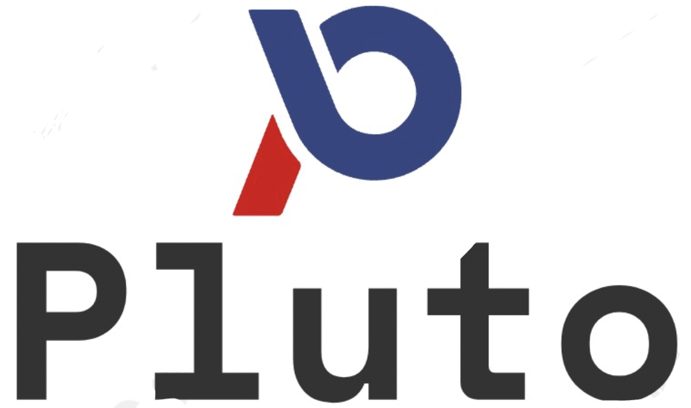

## Hey, this is Plutolang community 👋

 
  

Pluto is a new open-source programming language designed to help developers write cloud applications and **make it easier to use cloud services**.

Developers can directly use the **required resources, such as KV databases and message queues**, in their code based on their business needs. Pluto performs **static analysis** on the code to determine the **infrastructure resources** required by the application and deploys corresponding resource instances and applications on the specified cloud platform.

Let's look at a simple example:

[https://github.com/pluto-lang/pluto/assets/20160766/fcf83f66-5610-4bcc-b764-d0f84e60e07f](https://github.com/pluto-lang/pluto/assets/20160766/fcf83f66-5610-4bcc-b764-d0f84e60e07f)

If you prefer a hands-on approach to understanding what we are doing, here are some examples:

- [Build your own chatbot based on the OpenAI API.](https://github.com/pluto-lang/pluto/tree/main/examples/chat-bot)
- [Send a computer joke to the Slack channel every day.](https://github.com/pluto-lang/pluto/tree/main/examples/daily-joke-slack)

See the [main repo](https://github.com/pluto-lang/pluto) for more information.

## 💬 Community

Welcome to join our [Slack](https://join.slack.com/t/plutolang/shared_invite/zt-25gztklfn-xOJ~Xvl4EjKJp1Zn1NNpiw) community, or our DingTalk group at 40015003990 for communication.
